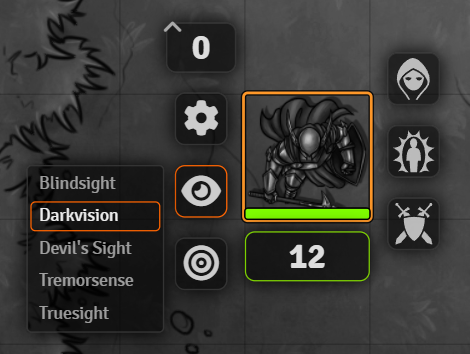
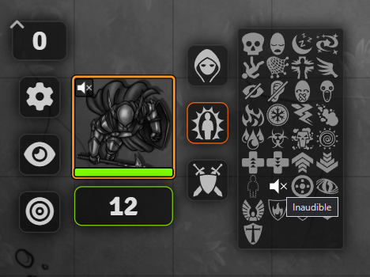
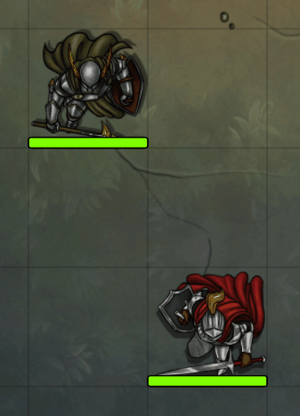

# Vision 5e (Foundry VTT Module)

Additional and improved Vision/Detection modes for D&D 5e including automatic vision management based on the actor's senses and active effects.

---

- **Blindsense**
- **Blindsight**
  - If the actor has the `Echolocation`[\*](#translations) or `Blind Senses`[\*](#translations) feat, Blindsight doesn't work while deafened.
  - _Note: Blindsight is blocked by total cover. There's no total cover wall restriction type. So Blindsight is blocked by sight-blocking walls, but doesn't go through proximity walls regardless of the distance to the wall. Therefore it is necessary to use proximity walls for glass windows._
- **Darkvision**
  - Unless blinded Darkvision detects any creature that isn't invisible and doesn't have the `Umbral Sight`[\*](#translations) feat.
- **Detect Evil and Good**
  - _Note: PCs do not have a creature type like NPCs. The following races are detected: `Centaur`[\*](#translations), `Changeling`[\*](#translations), `Fairy`[\*](#translations), `Hexblood`[\*](#translations), and `Saytr`[\*](#translations)._
  - _Note: Restricted by any sight-blocking wall, because there's no way to know what material the wall is made of or how thick it is._
- **Detect Magic**
  - _Note: Restricted by any sight-blocking wall, because there's no way to know what material the wall is made of or how thick it is._
  - _Note: Magic items are considered magical if the rarity is uncommon or higher. Mundane items should not have a rarity. Unfortunately, all mundane items in the system's item compendium are incorrectly given the common rarity, which means that all items that originated from this compendium pack would be detected as magical. Until this is fixed, common items are not considered magical to avoid a large number false positives._
- **Detect Poison and Disease**
  - Detects all creatures that have a poisonous natural weapon attack or have the _poisoned_ or _diseased_ status effect.
  - _Note: Restricted by any sight-blocking wall, because there's no way to know what material the wall is made of or how thick it is._
  - _Note: Some poisonous creatures might not be detected, because the Versatile Damage of the natural weapon attack is missing the `[poison]` flavor, which you'll need to fix yourself._
- **Detect Thoughts**
  - Detects all creatures that have an Intelligence of 4 or higher and speak at least one language.
  - _Note: Restricted by any sight-blocking wall, because there's no way to know what material the wall is made of or how thick it is._
- **Devil's Sight**
  - _Note: You need the [Limits](https://github.com/dev7355608/limits) module for magical darkness._
- **Divine Sense**
- **Ethereal Sight**
  - Allows detection of ethereal creatures.
- **Ghostly Gaze**
  - Detects anything Darkvision would but isn't blocked by walls.
- **Hearing**
  - Detects all creatures that do not have the _inaudible_ status effect and are not behind a sound-blocking walls. If the token is deafened, it cannot hear anything of course.
- **See Invisibility**
  - Allows detection of invisible and ethereal creatures.
- **Tremorsense**
  - Detects all creatures that do not have the _flying_ status effect.
  - Is unable to detect anything while the creature itself is flying.
  - _Note: Tremorsense works differently compared to core's Feel Tremor, which detects all creatures that are not above 0 elevation._
- **Truesight**
  - _Note: You need the [Limits](https://github.com/dev7355608/limits) module for magical darkness._
  - _Note: The original form of a shapechanger is not revealed nor highlighted with a special effect._
- **Witch Sight**
  - Allows detection of shapechangers.
  - _Note: An actor is an shapechanger if it has the `Shapechanger`[\*](#translations) subtype or the `Shapechanger`[\*](#translations) feat._
  - _Note: The original form of the shapechanger is not revealed._

_Basic Sight_ no longer detects creatures that are illuminate by light sources, which is now handled by the _Light Perception_ detection mode. Light perception being a separate detection modes allows you to configure the range of light perception. _Basic Sight_ is renamed to _Darkvision_.

---

Detection modes of tokens are automatically configured based on the actor's senses. They can be overridden by the token's detection modes though.

A token gains ...

- _Blindsense_ if the actor has a feat with the name `Blindsense`[\*](#translations).
- _Detect Evil and Good_ if the actor has an active effect with the name `Detect Evil and Good`[\*](#translations).
- _Detect Magic_ if the actor has an active effect with the name `Detect Magic`[\*](#translations) or a feat with the name `Sense Magic`[\*](#translations). The description of the `Sense Magic`[\*](#translations) feat must contains the range. An active effect named `Magic Awareness`[\*](#translations) grants 60 feet of Detect Magic.
- _Detect Poison and Disease_ if the actor has an active effect with the name `Detect Poison and Disease`[\*](#translations).
- _Detect Thoughts_ if the actor has an active effect with the name `Detect Thoughts`[\*](#translations).
- _Devil's Sight_ if the actor has a feat with the name `Devil's Sight`[\*](#translations), `Invocation: Devil's Sight`, `Invocations: Devil's Sight`, `Eldritch Invocation: Devil's Sight`, `Eldritch Invocations: Devil's Sight`, or `Eldritch Adept: Devil's Sight`. NPCs gain _Devil's Sight_ equal to their _Darkvision_ if they have the `Devil's Sight`[\*](#translations) feat.
  - _Note: Remove the active effect that gives 120 feet Darkvision from the *Invocation: Devil's Sight* feat if it exists: Devil's Sight doesn't increase the range of Darkvision._
- _Divine Sense_ if the actor has an active effect with the name `Divine Sense`[\*](#translations).
- _Ethereal Sight_ if the actor has a feat with the name `Ethereal Sight`[\*](#translations) and its description contains the range in feet.
- _Ghostly Gaze_ if the actor has an active effect with the name `Ghostly Gaze`[\*](#translations), `Invocation: Ghostly Gaze`, `Invocations: Ghostly Gaze`, `Eldritch Invocation: Ghostly Gaze`, `Eldritch Invocations: Ghostly Gaze`, or `Eldritch Adept: Ghostly Gaze`.
- _See Invisibility_ if the actor has an active effect with the name `See Invisibility`[\*](#translations).
- _Witch Sight_ if the actor has a feat with the name `Witch Sight`[\*](#translations), `Invocation: Witch Sight`, `Invocations: Witch Sight`, `Eldritch Invocation: Witch Sight`, `Eldritch Invocations: Witch Sight`, or `Eldritch Adept: Witch Sight`.

By default all tokens have hearing range of 30 feet. The default hearing range can be configured in the module settings.

If you use metric units, you need to change the units in the module settings.

---

The vision modes can be changed in token HUD. The player can select the preferred vision mode for their token and change it at any time on their own.

---

If a creature is burrowing, give it the _burrowing_ status effect. A burrowing creature cannot be detected by senses that are blocked by walls, but can be detected by senses like Hearing or Tremorsense for example. While burrowing the creature is effectively blinded and any light that the creature emits is suppressed.

---

If a token is in the ethereal plane, give it the _ethereal_ status effect. Tokens in the ethereal plane can see other ethereal tokens. Tokens that are not need _Truesight_ or _See Invisibility_ to see ethereal tokens.

---

If a token doesn't produce any sound, give it the _inaudible_ status effect, which is right next to the _invisible_ status effect.

---

_Detect Evil and Good_, _Detect Magic_, _Detect Poison and Disease_, _Detect Thoughts_, _Divine Sense_, _Hearing_, and _Tremorsense_ are all imprecise senses. They do not reveal any information about the detected token except for size, location (position and elevation), and player targets.

---

### Translations

| English                     | _Source_                              | German                         | French                                                                      |
| --------------------------- | ------------------------------------- | ------------------------------ | --------------------------------------------------------------------------- |
| `Blind Senses`              | _Monster feat_                        | `Blinde Sinne`                 | `Sens aveugles`                                                             |
| `Blindsense`                | _Rogue feat_                          | `Blindgespür`                  | `Perception aveugle`                                                        |
| `Centaur`                   | _Race_                                | `Zentaur`                      | `Centaure`                                                                  |
| `Changeling`                | _Race_                                | `Wechselbalg`                  | `Changelin`                                                                 |
| `Detect Evil and Good`      | _Spell_                               | `Gutes und Böses entdecken`    | `Détection du mal et du bien`                                               |
| `Detect Magic`              | _Spell_                               | `Magie entdecken`              | `Détection de la magie`                                                     |
| `Detect Poison and Disease` | _Spell_                               | `Gift und Krankheit entdecken` | `Détection du poison et des maladies`                                       |
| `Detect Thoughts`           | _Spell_                               | `Gedanken wahrnehmen`          | `Détection des pensées`                                                     |
| `Devil's Sight`             | _Warlock invocation_ / _Monster feat_ | `Teufelssicht`                 | `Vision de diable` / `Vision du diable` / `Vue de diable` / `Vue du diable` |
| `Divine Sense`              | _Paladin feat_                        | `Göttliches Gespür`            | `Perception divine`                                                         |
| `Echolocation`              | _Monster feat_                        | `Echolot`                      | `Écholocation` / `Écholocalisation`                                         |
| `Eldritch Adept`            | _Feat_                                | `Schauerlicher Adept`          | `Adepte occulte`                                                            |
| `Eldritch Invocation`       | _Warlock feat_                        | `Schauerliche Anrufung`        | `Invocation occultes` / `Manifestation occultes`                            |
| `Ethereal Sight`            | _Monster feat_                        | `Ätherische Sicht`             | `Vision éthérée` / `Vue éthérée`                                            |
| `Fairy`                     | _Race_                                | `Fee`                          | `Fée`                                                                       |
| `Ghostly Gaze`              | _Warlock invocation_                  | `Geisterhafter Blick`          | `Regard fantomatique`                                                       |
| `Hexblood`                  | _Race_                                | `Hexblut`                      | `Sang maudit`                                                               |
| `Magic Awareness`           | _Barbarian (Path of Wild Magic) feat_ | `Magische Wahrnehmung`         | `Conscience magique`                                                        |
| `Satyr`                     | _Race_                                | `Satyr`                        | `Satyre`                                                                    |
| `See Invisibility`          | _Spell_                               | `Unsichtbares sehen`           | `Détection de l'invisibilité`                                               |
| `Sense Magic`               | _Monster feat_                        | `Magie spüren`                 | `Détection de la magie` / `Perception de la magie`                          |
| `Shapechanger`              | _Monster feat/subtype_                | `Gestaltwandler`               | `Métamorphe`                                                                |
| `Umbral Sight`              | _Ranger (Gloomstalker) feat_          | `Düstersicht`                  | `Vision des ombres`                                                         |
| `Witch Sight`               | _Warlock invocation_                  | `Hexensicht`                   | `Vision de sorcier` / `Vision sorcière` / `Vue de sorcier` / `Vue sorcière` |

_Note: The automation is not case-sensitive._

_Note: You may use `'` or `’` for apostrophes._

_Note: In French the colon (`:`) is preceded by a space, but it isn't required in order for the automation to detect the feat. For example, both `Manifestation : Regard fantomatique` and `Manifestation: Regard fantomatique` work._

_Note: French feats can have the class name in brackets in their names (for example `[Occultiste]`). It may be present but doesn't have to be. It doesn't affect the automation._
